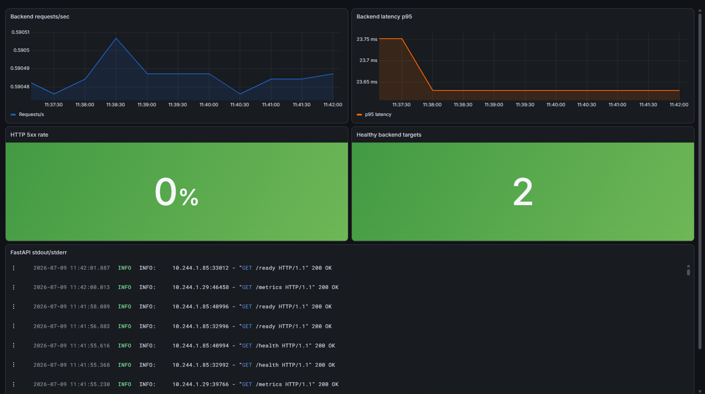
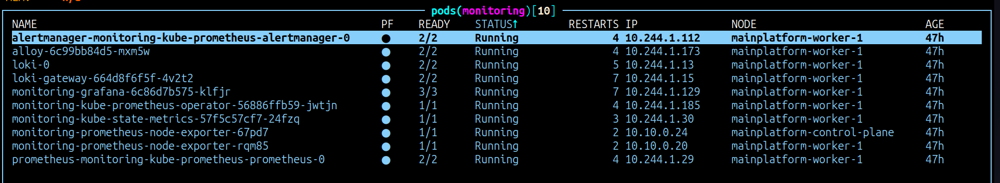
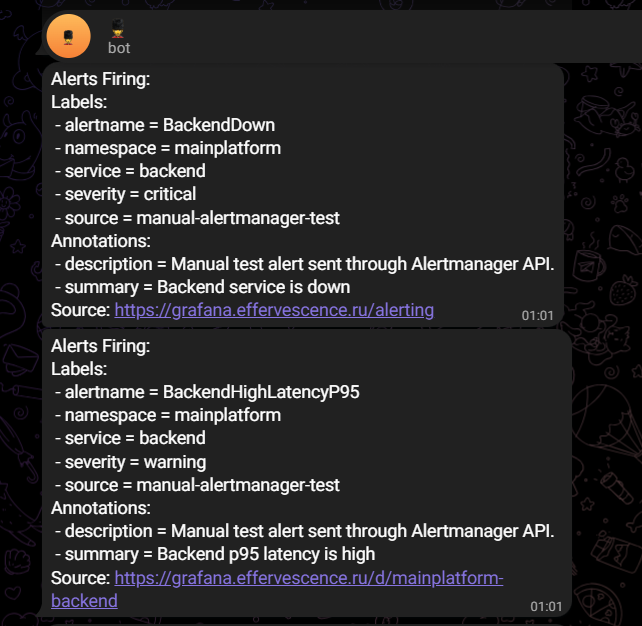

# Observability

**`Стек: Prometheus · Prometheus Operator · Alertmanager · Grafana · Loki · Alloy · Helm`**

> *Основные метрики приложения на `grafana.effervescence.ru`*

Весь стек мониторинга развёрнут через Helm-чарт, который раскатывается [Ansible ролью cluster_addons](ansible/).

**Prometheus** собирает: состояние объектов Kubernetes (нод, подов, контейнеров), состояние стека мониторинга, а также и Backend приложения, которое сам отдаёт метрики на эндпоинте `/metrics`, это прописано в [коде самого приложения](code/main.py), а также в [ServiceMonitor](kubernetes/backend-servicemonitor.yaml), чтобы Prometheus знал о необходимости сбора метрик у приложения.

**Alloy** установлен на каждой ноде и читает логи через Kubernetes API вообще со всех подов в кластере, присваивает метаданные (labels) к логам, после чего логи направляются в **Loki**, который хранит логи, а также их индексирует. **Loki** подключён к Grafana как источник данных, поэтому логи можно удобно смотреть в том же приложении, где и метрики.

В **Grafana** создан дашборд с основными метриками и логами для Backend приложения (на первом изображении), а также по умолчанию в Helm чарте идут полезные метрики Kubernetes. Свой dashboard применяется автоматически через Argo CD, на основе манифеста [kustomization.yaml](kubernetes/kustomization.yaml). 

Реализовано 3 алерта: 95% запросов дольше 500 мс за 5 мин (p95 latency), больше 5% 5xx ответов в течение 5 минут, а также если нет ни одного живого backend таргета. Все они описаны в [backend-prometheusrule.yaml](kubernetes/backend-prometheusrule.yaml) и применяются автоматически через Argo CD. Заметить алерт можно в Grafana, а также **Alertmanager** отправляет сообщение в телеграм.

*Полный код проекта:* [github.com/1001-Night/petProject-mainPlatform](https://github.com/1001-Night/petProject-mainPlatform)
*В нём ссылки на описания других аспектов проекта: CI/CD, Kubernetes и IaC, а также описание того как самостоятельно воспроизвести всю инфраструктуру с нуля*